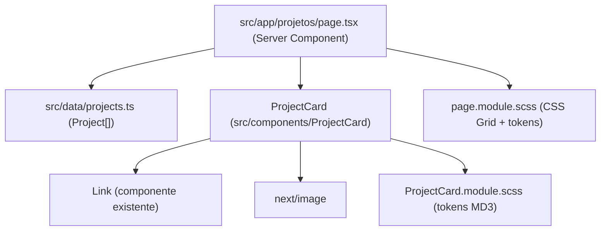

# Página de Projetos (Grid)

> **Status**: Done
> **Created**: 2026-07-22

## 1. Business Context

### Problem Statement

O portfólio de Luan dos Santos hoje exibe apenas um placeholder "Em breve". Visitantes (recrutadores, colegas de trabalho e a comunidade dev) não têm como conhecer os projetos em que Luan trabalhou, o que reduz o valor do site como vitrine profissional. É necessária uma página dedicada que apresente os projetos em um grid visual, com informações suficientes para o visitante entender o que cada projeto é e explorar mais (código-fonte, demo).

### Goals

- Publicar uma página `/projetos` acessível a partir da home, listando todos os projetos cadastrados.
- Cada projeto exibe nome, descrição, tecnologias utilizadas e links (repositório e/ou demo).
- Layout responsivo: grid fluido do mobile (1 coluna) ao desktop (3+ colunas), usando os design tokens existentes.
- Página estática (SSG) com carregamento rápido — sem chamadas de rede em runtime.

### User Stories

#### US-1: Visualizar projetos em grid

- **Story**: Como visitante do portfólio, quero ver os projetos em um grid visual, para conhecer rapidamente o trabalho do Luan.
- **Acceptance Criteria**:
  - **Given** que existem projetos cadastrados, **when** o visitante acessa `/projetos`, **then** todos os projetos são exibidos em um grid de cards, cada um com nome, descrição, tecnologias e links.
  - **Given** que o visitante está em um dispositivo mobile (viewport < 600px), **when** a página é renderizada, **then** o grid exibe 1 card por linha sem overflow horizontal.
  - **Given** que o visitante está em desktop (viewport ≥ 1024px), **when** a página é renderizada, **then** o grid exibe pelo menos 3 cards por linha.

#### US-2: Acessar detalhes externos de um projeto

- **Story**: Como visitante, quero acessar o repositório ou a demo de um projeto, para explorar o código e o resultado final.
- **Acceptance Criteria**:
  - **Given** um projeto com `repoUrl` cadastrada, **when** o visitante clica no link de repositório do card, **then** o repositório abre em nova aba (`target="_blank"` com `rel="noopener noreferrer"`).
  - **Given** um projeto sem `demoUrl`, **when** o card é renderizado, **then** o link de demo não é exibido (sem link quebrado ou desabilitado).

#### US-3: Navegar da home para os projetos

- **Story**: Como visitante, quero navegar da home para a página de projetos, para encontrar o conteúdo sem digitar a URL.
- **Acceptance Criteria**:
  - **Given** que o visitante está na home (`/`), **when** clica no link/CTA "Projetos", **then** é levado para `/projetos` via navegação client-side do Next.js (componente `Link` existente).

### Key Scenarios

| Scenario | Pre-conditions | Steps | Expected Result |
|---|---|---|---|
| Happy path: listagem completa | `projects.ts` contém N ≥ 1 projetos | Visitante acessa `/projetos` | Grid renderiza N cards com nome, descrição, tags de tecnologia e links; título da página e metadata corretos |
| Error case: imagem de projeto indisponível | Projeto cadastrado com `imageUrl` inválida/ausente | Visitante acessa `/projetos` | Card renderiza com placeholder visual (cor de surface dos tokens) no lugar da imagem; layout do grid não quebra |
| Edge case: lista vazia | `projects.ts` exporta array vazio | Visitante acessa `/projetos` | Página renderiza estado vazio amigável ("Nenhum projeto por aqui ainda") em vez de grid em branco |
| Edge case: textos longos | Projeto com nome/descrição muito longos | Visitante acessa `/projetos` | Card trunca a descrição com ellipsis (line-clamp) mantendo altura consistente entre cards da mesma linha |

### Functional Requirements

- FR-1: Nova rota `/projetos` no App Router com `page.tsx` e `page.module.scss` próprios.
- FR-2: Componente reutilizável `ProjectCard` em `src/components/ProjectCard/`, exportado via barrel.
- FR-3: Fonte de dados estática e tipada em `src/data/projects.ts` exportando `Project[]`.
- FR-4: Cada card exibe: imagem/thumbnail (opcional), nome, descrição, lista de tecnologias (tags) e links externos (repositório e demo, ambos opcionais).
- FR-5: Metadata da página (title/description) via `export const metadata` do Next.js, em português.
- FR-6: Link de navegação da home para `/projetos`.

### Non-Functional Requirements

- **Performance**: página 100% estática (Server Component, sem `use client` na rota); imagens via `next/image` com lazy loading.
- **Acessibilidade**: cards navegáveis por teclado; links com texto acessível (não apenas ícone); contraste seguindo a paleta MD3 existente; landmarks semânticos (`main`, `section`, headings hierárquicos).
- **Responsividade**: CSS Grid com `auto-fill`/`minmax`, sem media queries hardcoded onde o grid fluido resolver.
- **Consistência visual**: usar exclusivamente tokens de `src/styles/tokens/` e `src/styles/colors/`; sem valores hardcoded; SCSS Modules (nunca CSS inline).
- **Qualidade**: componentes com testes (Jest + Testing Library); lint/format via Biome sem erros.

### Out of Scope

- Página de detalhe individual por projeto (`/projetos/[slug]`).
- Filtro/busca por tecnologia ou categoria.
- Integração com API do GitHub para popular projetos automaticamente.
- CMS ou painel de administração para gerenciar projetos.
- Internacionalização (site permanece somente em pt-br).

---

## 2. Arch Decisions

### Proposed Solution

Criar uma rota estática `/projetos` no App Router que importa uma lista tipada de projetos de `src/data/projects.ts` e a renderiza em um grid CSS. O grid é composto por componentes `ProjectCard` (novos, seguindo o padrão dos componentes `Button` e `Link` existentes: diretório próprio, SCSS Module, barrel export, `formatClassName` para classes compostas). Toda a página é Server Component — não há estado nem interatividade além de links, portanto nenhum JavaScript client-side adicional é enviado.

### Architecture Overview



### Alternatives Considered

| Alternative | Pros | Cons | Verdict |
|---|---|---|---|
| Dados estáticos tipados em `src/data/projects.ts` | Zero infraestrutura, type-safe, versionado no git, build estático | Atualizar projeto exige commit/deploy | **Aceito** — adequado à fase atual do site e à frequência baixa de atualização |
| API do GitHub em build time (repos pinados) | Atualização automática, menos manutenção manual | Dependência externa no build, rate limit, menos controle editorial (descrição, imagem, ordem) | Rejeitado para v1 — pode evoluir depois sem mudar o contrato `Project` |
| CMS headless (ex.: Contentful) | Edição sem deploy | Custo/complexidade desproporcionais para um portfólio pessoal | Rejeitado |
| Seção de projetos na home (sem rota nova) | Menos navegação | Home ainda é placeholder; página dedicada escala melhor e tem URL compartilhável | Rejeitado — rota dedicada `/projetos` |

### Risks & Mitigations

| Risk | Impact | Likelihood | Mitigation |
|---|---|---|---|
| Imagens de projetos com proporções variadas quebrarem o grid | Med | Med | `aspect-ratio` fixo no card + `object-fit: cover` no `next/image`; placeholder quando ausente |
| Cards com alturas inconsistentes por textos variados | Low | High | `line-clamp` na descrição e altura mínima definida por tokens |
| Crescimento da lista degradar a página (muitas imagens) | Low | Low | Lazy loading nativo do `next/image`; paginação fica como evolução futura |

### Key Decisions

#### Decision 1: Fonte de dados estática e tipada

- **Status**: Accepted
- **Context**: Os projetos precisam ser cadastrados em algum lugar; o site não tem backend nem CMS.
- **Decision**: Arquivo `src/data/projects.ts` exportando `projects: Project[]` com tipo `Project` definido junto.
- **Consequences**: Atualizações exigem commit, mas o contrato `Project` isola a página da origem dos dados — trocar por GitHub API ou CMS no futuro não altera componentes.

#### Decision 2: Rota dedicada `/projetos`

- **Status**: Accepted
- **Context**: O conteúdo poderia viver na home ou em rota própria. O site é em pt-br.
- **Decision**: Nova rota `src/app/projetos/page.tsx`, com slug em português coerente com `lang="pt-br"`.
- **Consequences**: URL compartilhável e indexável; home ganha apenas um link de navegação.

#### Decision 3: Server Components sem JS client-side

- **Status**: Accepted
- **Context**: A v1 não tem filtro, busca ou interatividade além de links.
- **Decision**: Página e `ProjectCard` são Server Components (sem `use client`).
- **Consequences**: Bundle mínimo e SSG puro. Se filtros forem adicionados depois, apenas o componente de filtro vira client, não o grid inteiro.

#### Decision 4: Grid com CSS Grid fluido

- **Status**: Accepted
- **Context**: O grid precisa ser responsivo de 1 a 3+ colunas.
- **Decision**: `display: grid` com `grid-template-columns: repeat(auto-fill, minmax(<token>, 1fr))` e gaps dos tokens de spacing.
- **Consequences**: Responsividade sem media queries dedicadas; o número de colunas deriva do espaço disponível.

### Implementation Plan

1. **Dados**: criar `src/data/projects.ts` com o tipo `Project` e ao menos 3 projetos reais cadastrados.
2. **Componente**: criar `ProjectCard` (`Card + SCSS Module + index.ts + testes`) seguindo o padrão de `Button`/`Link`; exportar no barrel `src/components/index.ts`.
3. **Rota**: criar `src/app/projetos/page.tsx` + `page.module.scss` com o grid, metadata e estado vazio.
4. **Navegação**: adicionar link "Projetos" na home usando o componente `Link` existente.
5. **Verificação**: testes (`npm run test:ci`), lint/format (`npm run lint`, `npm run format`) e build (`npm run build`).

---

## 3. Technical Contract

### Data Models

```ts
// src/data/projects.ts
export interface Project {
  /** Identificador único e estável (kebab-case) — futuro slug de detalhe */
  id: string
  name: string
  description: string
  /** Tecnologias exibidas como tags, na ordem de relevância */
  technologies: string[]
  /** Caminho em /public ou URL absoluta; opcional (card usa placeholder) */
  imageUrl?: string
  repoUrl?: string
  demoUrl?: string
  /** Destaque futuro (ordenação); default false */
  featured?: boolean
}

export const projects: Project[]
```

### Interfaces

```ts
// src/components/ProjectCard/ProjectCard.tsx
export interface ProjectCardProps {
  project: Project
  className?: string
}
// Server Component: recebe o projeto inteiro; não emite eventos.
```

- `src/app/projetos/page.tsx`: Server Component default export, sem props; exporta `metadata` (title "Projetos — Luan dos Santos", description em pt-br).
- `src/components/index.ts`: passa a reexportar `ProjectCard` e `ProjectCardProps`.

### Integration Points

- **Componente `Link` existente** (`@/components`): usado para os links externos do card e para a navegação home → `/projetos`.
- **`next/image`**: renderização otimizada das thumbnails; imagens locais em `public/projects/`.
- **Design tokens** (`@/styles/tokens`, `@/styles/colors`): única fonte de cores, espaçamentos e tamanhos dos SCSS Modules novos.
- **`formatClassName`** (`@/utils`): composição de classes no `ProjectCard`.

### Invariants & Constraints

- Todo `Project.id` é único dentro de `projects`.
- Um card nunca renderiza link sem URL correspondente (links opcionais são omitidos, nunca desabilitados).
- Links externos sempre abrem com `target="_blank"` e `rel="noopener noreferrer"`.
- Nenhum componente da rota usa `use client`, CSS inline ou valores de estilo hardcoded.
- A página compila estaticamente (`npm run build` sem warnings de rota dinâmica).
